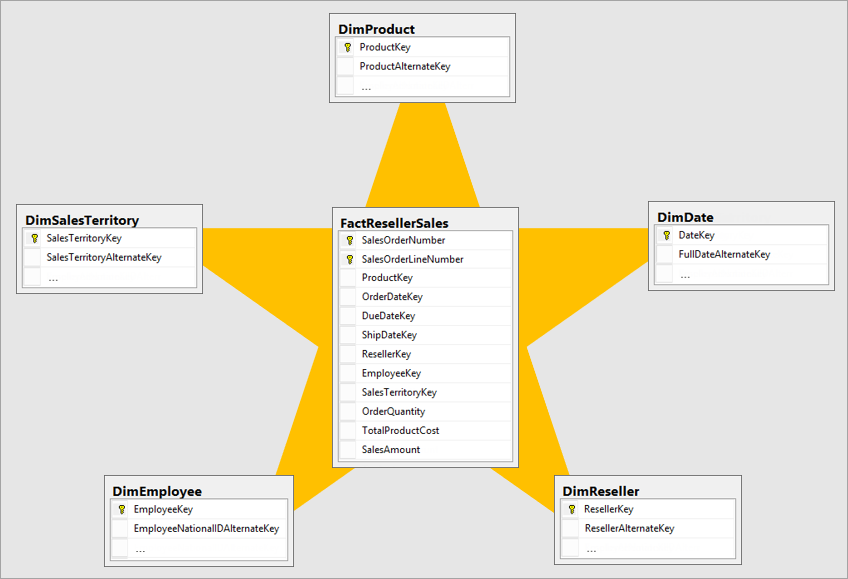

# dbt build a datawarehouse using dimensional modeling
This is a dbt repo. We build a practical datawarehouse using Kimball dimensional model with dbt. 

We use a transactional database, SQL Server, [AdventureWorks2019](https://learn.microsoft.com/en-us/sql/samples/adventureworks-install-configure?view=sql-server-ver16&tabs=ssms) as our source. We extract and load data with an EL tool [Airbyte](https://www.youtube.com/watch?v=2FvMa7vaxDY&t).

## Project Setup
You will need the following Tech Stack to following along with this project. 

- You can setup SQL Server's environment using the [following guidelines](https://www.youtube.com/watch?v=e5mvoKuV3xs&t=6s)
- PostgreSQL setup guide [link](https://www.youtube.com/watch?v=fjYiWXHI7Mo)
- Airbyte setup [guide](https://www.youtube.com/watch?v=2FvMa7vaxDY&t)
- dbt setup [guide](https://www.youtube.com/watch?v=gH1w4OIgXj4)
- Python 3.8 or above [installation guide](https://www.youtube.com/watch?v=B0G-44dqHRM&t)
- dbt 1.4.5 or above
- dbt postgres plugin 1.4.5 or above

Using dbt we transform this data into dimensions and facts. 

## Source tables/views used from AdventureWorks datatabase
| schemaname 	| tablename                   	| type  	|
|------------	|-----------------------------	|-------	|
| source     	| address                     	| table 	|
| source     	| customer                    	| table 	|
| source     	| salesorderdetail            	| table 	|
| source     	| salesorderheadersalesreason 	| table 	|
| source     	| salesorderheader            	| table 	|
| source     	| vw_countryregion            	| view  	|
| source     	| vw_product                  	| view  	|
| source     	| vw_productcategory          	| view  	|
| source     	| vw_person                   	| view  	|
| source     	| vw_store                    	| view  	|
| source     	| vw_salesreason              	| view  	|
| source     	| vw_salesterritory           	| view  	|
| source     	| vw_productsubcategory       	| view  	|
| source     	| vw_stateprovince            	| view  	|

## Dimensional Modeling 101
To understand Kimball’s approach to data modeling, we should begin by talking about the star schema. The star schema is a particular way of organizing data for analytical purposes. It consists of two types of tables:
- A fact table, which acts as the primary table for the schema. A fact table contains the primary measurements, metrics, or ‘facts’ of a business process.
- Many dimension tables associated with the fact table. Each dimension table contains ‘dimensions’ — that is, descriptive attributes of the fact table.

  

## Advantages of Dimensional Modelling
- Dimensional data modeling enables users to easily access data through simple queries, reducing the time and effort required to retrieve and analyze data.
- The simple structure of dimensional data modeling allows for faster query performance, particularly when compared to relational data models.
- Dimensional data modeling allows for more flexible data analysis, as users can quickly and easily explore relationships between data.
- Dimensional data modeling can improve data quality by reducing redundancy and inconsistencies in the data.
- Dimensional data modeling uses simple, intuitive structures that are easy to understand, even for non-technical users.
  These dimensional tables 'surround' the fact table, which is where the name 'star schema' comes from.
